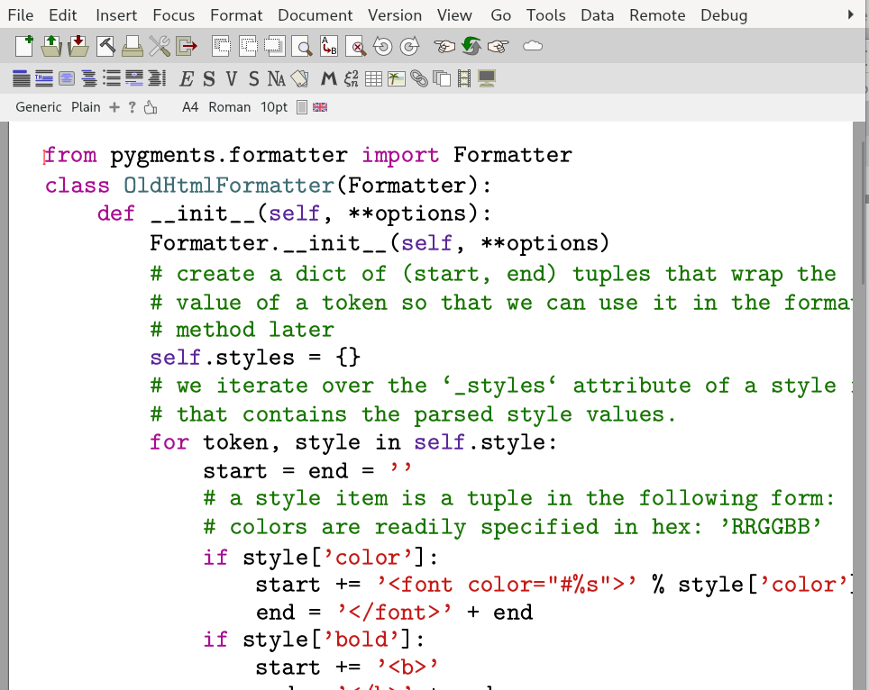

# tm-pygments
**Syntax highlighting in TeXmacs using Pygments**



## Installation
To install this plugin, put the files in this repository in a folder `pygments` under `$TEXMACS_HOME_PATH/plugins/` (i.e. under `~/.TeXmacs/plugins/pygments` on Linux or Mac).

After installation, the directory structure should be as follows:
```
TEXMACS_HOME_PATH
└─── plugins
     └─── pygments
          └─── progs
          └─── src
```

You may have to do `Tools → Update → Plugins` or restart TeXmacs after installation.

To use this TeXmacs plugin, Python and [Pygments](https://pygments.org/)  need to be installed.

## Usage

The first line of input needs to specify the code language and the desired colour style. This line needs to begin with `%`, followed by language and colour style, separated by `;`. For example, use `% cpp; xcode` to highlight `C++` code in the `xcode` style.

The main use case envisaged for this plugin is to highlight code in documents using an "executable fold". These can be inserted via `Insert → Fold → Executable → Pygments`. Enter the code, together with language and style selection, and activate the fold (check `Fold → Evaluate`). The input can later be retrieved and edited by deactivating the fold in the same way (uncheck `Fold → Evaluate`).
